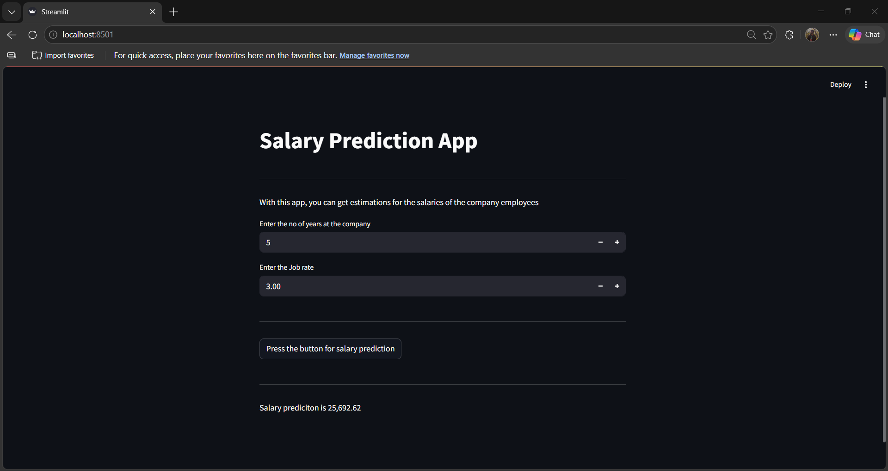
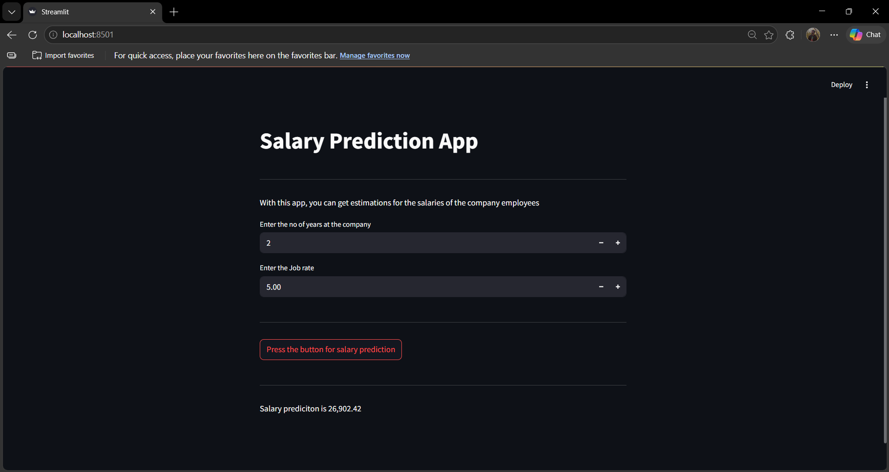

# Employee_Salary_Prediction_ML

## 1. Project Title / Headline  
An end-to-end Machine Learning pipeline that predicts employee annual salaries based on key workforce features, deployed as an interactive Streamlit web application.

## 2. Short Description / Purpose  
This project transforms raw employee HR data into a deployable salary estimation tool. By analyzing features like years at the company and job rate, the model estimates an employee's annual salary — served through a clean web app that requires no coding to use. It can assist HR teams and managers in making data-driven compensation decisions.

## 3. Tech Stack  
- **Python** - Data analysis, modeling, and app development
- **Pandas/Numpy** - Data loading, exploration, and preprocessing
- **Matplotlib & Seaborn** – Exploratory visualizations (gender distribution, salary by department, job rates by country, overtime hours)
- **Scikit-learn** – Model training and evaluation
- **Joblib** – Model serialization (linearmodel.pkl)
- **Streamlit** – Interactive web application
- **File Format** – `.ipynb` ,`.py`,`.pkl` and `.xlsx`

## 4. Data Source  
- Source: [Kaggle – Company Employees](https://www.kaggle.com/datasets/abdallahwagih/company-employees)
- Volume: 689 rows × 15 columns, No missing values, No duplicates
- Countries Covered: Egypt, Saudi Arabia, United Arab Emirates, Syria, Lebanon
- Other Available Columns: name, gender, start date, department, country, center, monthly salary, sick leaves, unpaid leaves, overtime hours
- Target Variable: annual_salary (Range: $8,436 – $41,400 | Mean: ~$24,818)
- Feature Variables: years (years at company), job_rate (performance rating 1–5)
  
## 5. Features / Highlights
### EDA Highlights
- Gender Distribution — Pie chart showing the male/female split across the workforce
- Salary by Department — Top 7 departments by average annual salary (bar chart)
- Job Rate by Country — Average job ratings across Egypt, Saudi Arabia, UAE, Syria, and Lebanon
- Overtime Hours Distribution — Histogram showing most employees work between 0–50 overtime hours, with a few outliers reaching 198 hours

### Model Training (80/20 Split)
- Linear Regression — Default parameters → MAE: ~$7,776
Linear Regression was selected as the model due to the straightforward linear relationship between years of experience, job rate, and salary in this dataset. The trained model was saved as linearmodel.pkl for deployment.

### Streamlit Web App
Users input employee details via the UI and click Press the button for salary prediction to receive an instant salary estimate.
```python
pip install streamlit joblib scikit-learn numpy
streamlit run app.py
```

#### Sample Predictions:
- 5 years | Job Rate 3.0 → $25,692.62
- 2 years | Job Rate 5.0 → $26,902.42

## 6. ML Code Highlights
- Feature Selection & Train-Test Split
```python
X = df[["years", "job_rate"]]
y = df["annual_salary"]
X_train, X_test, y_train, y_test = train_test_split(X, y, test_size=0.2)
```

- Model Training & Evaluation
```python
from sklearn.linear_model import LinearRegression
from sklearn.metrics import mean_absolute_error

lr = LinearRegression()
lr.fit(X_train, y_train)
lr_pred = lr.predict(X_test)
mean_absolute_error(lr_pred, y_test)
# Output: 7776.23
```

- Saving & Loading the Model
```python
import joblib
joblib.dump(lr, "linearmodel.pkl")       # Save
model = joblib.load("linearmodel.pkl")   # Load in Streamlit
```


## 7. Business Impact & Insights
- Years at company and job rate are the two primary drivers selected for salary prediction, reflecting that tenure and performance are the most direct compensation factors
- Department matters — top departments like Major Mfg Projects and Quality Control show higher average salaries
- Country-level differences exist in job rates, suggesting regional compensation strategies may differ
- The Streamlit app gives HR managers and team leads a quick, accessible tool to estimate fair salary ranges without needing data science expertise

## 8. Screenshots / Demos  


